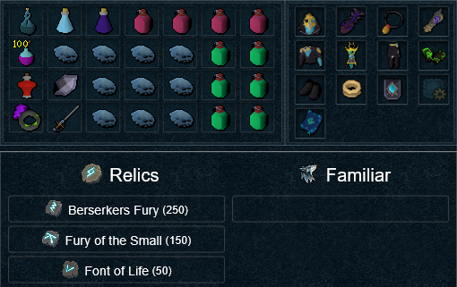
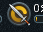
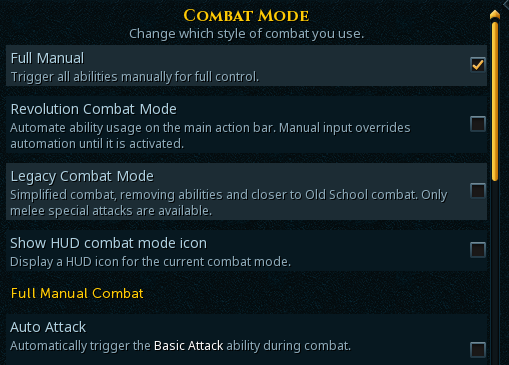
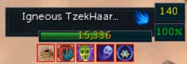
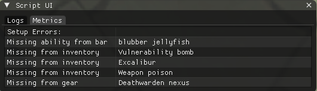
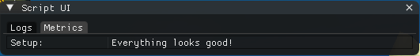

# Overview
### What does this script do?
- Attempts to complete the normal mode zuk fight in its entirety without banking
- Uses T90 necromancy
- Potentially completes the 3 challenge waves to unlock hard mode (may take multiple runs)
- Capable of starting from a checkpoint wave (e.g. if you died or teleported out on previous run)
- Exits once the fight is over or if you die
### What does this script not do?
- Does not farm Zuk
- Does not bank for you
- Does not start the instance for you
- Does not deactivate buffs after completing the fight
### Dependencies
- Uses [SonSon's Prayer Flicker](https://github.com/sonsonmagro/Sonsons-Prayer-Flicker) for prayer management (already included as part of this repo)
- Uses an old Timer library from nullopt
# Tested with the following
*NOTE: You'll notice that there are no BIS requirements. Using better stuff will probably speed things up a bit. Testing was also done without an Aura or familiar.*
### Gear
- T90 Tank Necro robes (important, we tank a lot throughout the fight with these + Darkness)
- Tokkul Zo Ring (2,000+ charges recommended)
- T90 Death guard and skull lantern
- Cinderbanes
- Amulet of Souls
- Deathwarden nexus for necro runes (make sure you have enough runes and ectoplasm)
- Scripture of Wen (does not proc AoE damage as much as I thought it would during this fight)

### Relics and Passives
- Fury of the Small
- Berserker's Fury
- Font of Life
- Ring of Vigour passive

### Skills
- 99 necro
- 99 defence
- T95 necro prayer (Sorrow)

### Consumables
- Elder overload
- Blubber jellyfish + guthix rest
- Super adrenaline potions
- Excalibur
- Vuln bombs
- Powerburst of vitality (used for challenge wave 3)

### Example setup
[Link to preset](https://pvme.io/preset-maker/#/BTbFTwSsydEsepYZJOV6)



## Interface requirements
- Auto-retaliate disabled: 
- Multiple action bars to fit all of the abilities. Refer to the section below for more info.
- Ability queuing disabled
- Full manual **enabled** (Settings -> Gameplay -> Combat & Action Bar -> Combat Mode -> Full Manual)
- Necromancy auto attack **disabled** (Settings -> Gameplay -> Combat & Action Bar -> Combat Mode -> Auto Attack)



- Make sure this thing is shown when you are in combat:


# How to install
1. Create a new folder under `~/Documents/MemoryError/Lua_Scripts/` and name it whatever you want
2. Copy lua files and folders from this repo into the new folder. The folder structure should look like this:
```bash
Lua_Scripts/
└── MyFirstZukCape/
    ├── main.lua
    ├── setup.lua
    └── zukLib/
        ├── prayer_flicker.lua
        └── timer.lua
```
3. Make sure cache loading is enabled in the `settings.json` file for ME.

# Before your first run
1. You will need to edit the `setup.lua` file to match your gear and consumables:
```lua
--------------------------------------------------------------------------------------------------------------------------------
--# CHANGE THESE VALUES TO MATCH YOUR SETUP. DEFAULTS SHOWN BELOW.
--------------------------------------------------------------------------------------------------------------------------------
-- Variable Name          | Default Value       | Description
--------------------------------------------------------------------------------------------------------------------------------
Setup.HAS_ZUK_CAPE         = false                -- Whether you are using the Zuk Necro cape or not
Setup.RING_SWITCH          = "Occultist's ring"   -- Name of ring to switch to for Zuk fight (exact match required)
Setup.ADREN_POT_NAME       = "Super adrenaline"   -- Name of the adrenaline potion (partial match allowed)
Setup.FOOD_NAME            = "blubber jellyfish"  -- Name of the food on your action bar (partial match allowed)
Setup.FOOD_POT_NAME        = "Guthix rest"        -- Name of the food potion on your action bar (partial match allowed)
Setup.RESTORE_NAME         = "Super restore"      -- Name of the restore potion (partial match allowed)
Setup.NECRO_PRAYER_NAME    = "Sorrow"             -- Name of the Necromancy prayer (exact match required)
Setup.NECRO_PRAYER_BUFF_ID = 30771                -- Buff ID for the Necromancy prayer when active (find using API.Buffbar_GetAllIDs)
Setup.OVERLOAD_NAME        = "Elder overload"     -- Name of the overload potion (partial match allowed)
Setup.OVERLOAD_BUFF_ID     = 49039                -- Buff ID for the overload potion when active (API.Buffbar_GetAllIDs)
Setup.USE_BOOK             = true                 -- Whether to use a scripture book (false ignores the book values below)
Setup.BOOK_NAME            = "Scripture of Wen"   -- Name of the scripture book on your action bar (exact match required)
Setup.BOOK_BUFF_ID         = 52117                -- Buff ID for the scripture book when activated
Setup.USE_EXCAL            = true                 -- Whether to use Enhanced Excalibur for healing (must be in inventory)
Setup.USE_ELVEN_SHARD      = true                 -- Whether to use Elven Ritual Shard for prayer restore (must be in inventory)
Setup.USE_POISON           = true                 -- Whether to use weapon poison (any type, must be in inventory)
--------------------------------------------------------------------------------------------------------------------------------
--# END
--------------------------------------------------------------------------------------------------------------------------------
```
2. After you have edited the `setup.lua` file, you can run it like any other script to do a quick sanity check. This will mainly check if all abilities are present on action bars, along with some other items.

***NOTE**: This will **NOT** check if you have the correct quantities of everything, such as tokkul-zo ring charges, necro runes, ectoplasm, etc. It doesn't know your gear loadout either. It is just a quick sanity check to make sure you have most of the things that the script expects to be there.*
- What you might see if `setup.lua` found missing items:



- What you should see if `setup.lua` found nothing missing:



# How to run the script
1. Ensure you are geared and `setup.lua` is happy as shown in the previous section.
2. In game, head to Zuk (I'll usually charge from adren crystal then enter portal at Wars)
3. Start the fight by talking to Zuk.
  * **NOTE**:You will either be prompted for a fresh instance or to start from a checkpoint wave. Either option is fine for this script.
4. Once you are in the fight, run the `main.lua` file located in the same folder as `setup.lua`.
  * **NOTE**:When loading the script, navigate to it by double clicking the folder first and then `main.lua`. For some reason, the quick load option in the bottom left does not find the library files correctly and the script will not run.